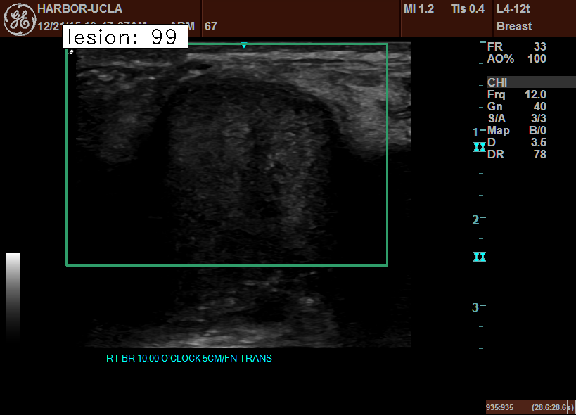
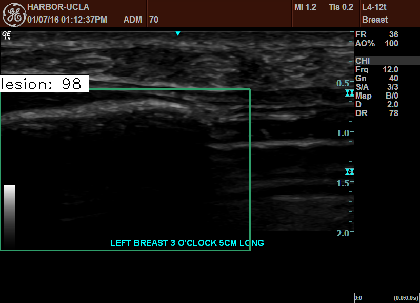
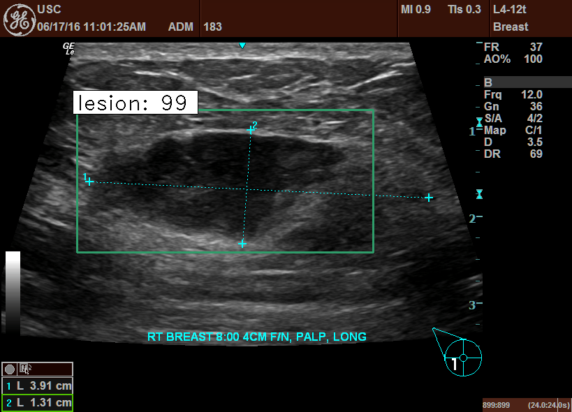
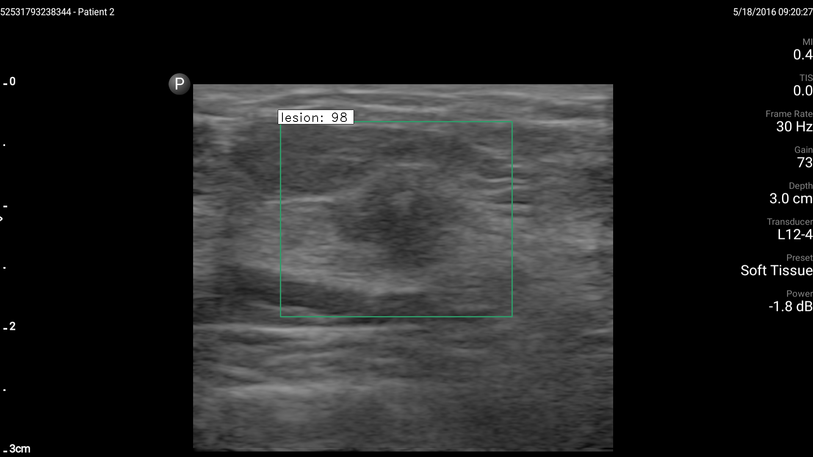
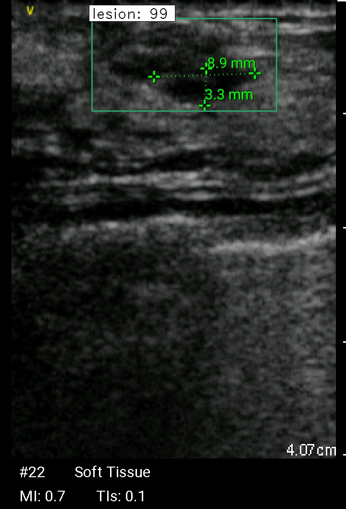

# CADtnet

> Computer-Aided Diagnostics & Triaging Network

Scans real-world Breast Ultrasound Scans to get a region-of-interest and classify scans among BI-RADS scores. 
BI-RADS scores measure the malignancy.

| 1 | 2 | 3 | 
|---|---|---|
| |  | | 
| | | | 
| | ||

**Tech Stack**: Python, Tensorflow, Keras, RADIant, pyDICOM, imgaug, Numpy, Tensorflow-lite
**Data**: Medical Images (Real world Ultrasound scans)
