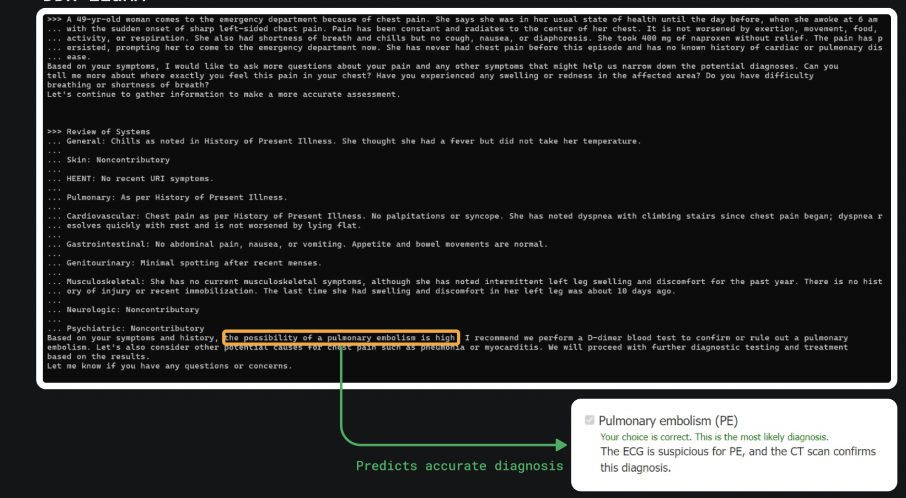
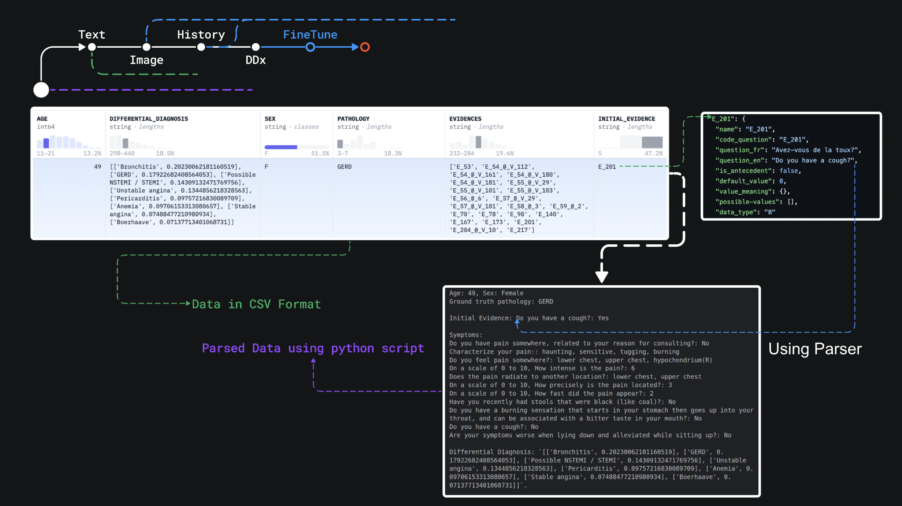

# MedIntel

Medical LLM finetuned on med-llama and LLaVa-Med DDx plus dataset to enable long-form question answering to perform differentail diagnoses among 47 dominant ailments. 

https://docs.google.com/presentation/d/1clfiRNQQGGYfUDSeuxT2Do34Hv-xtLdPDOyYpLhIi2E/edit?usp=sharing

