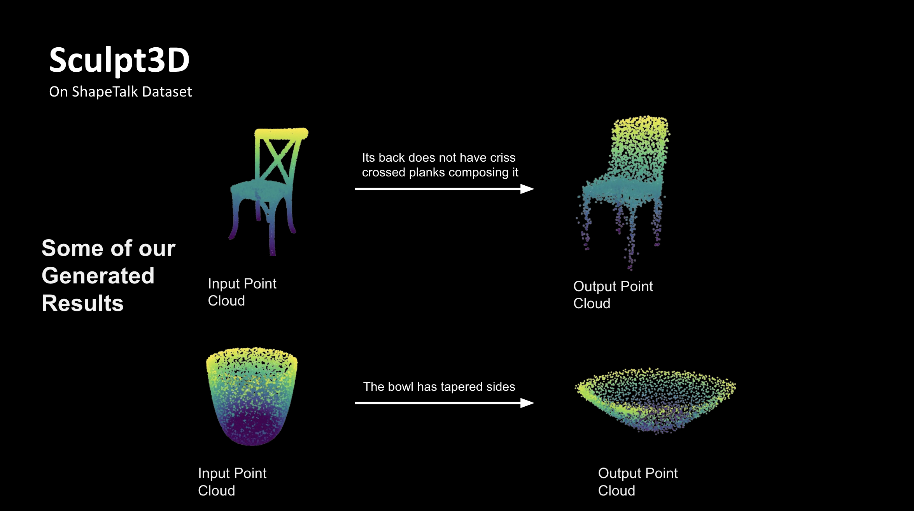
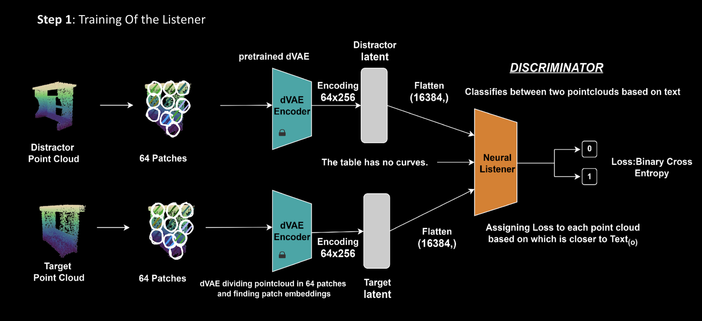
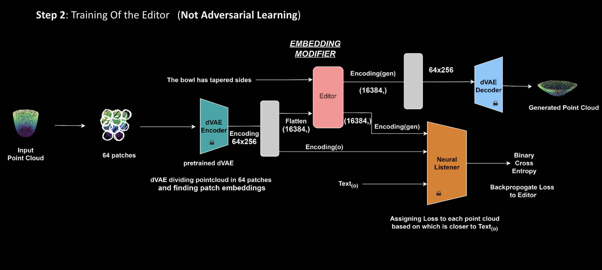

# Sculpt3D 

Inspired from SDfusion and Changeit3D, we develop a method to generate and edit point clouds via multimodal inputs i.e. sketch, image, text, point cloud. 

- Modified encoder to give finer and granular reconstruction of the point cloud.

When prompted please ask for access there with your email.
https://docs.google.com/presentation/d/1nbC5woZp3DiEUsQ4zLkT-69_D8-bjStx/edit?usp=sharing&ouid=113644110566028420507&rtpof=true&sd=true 
