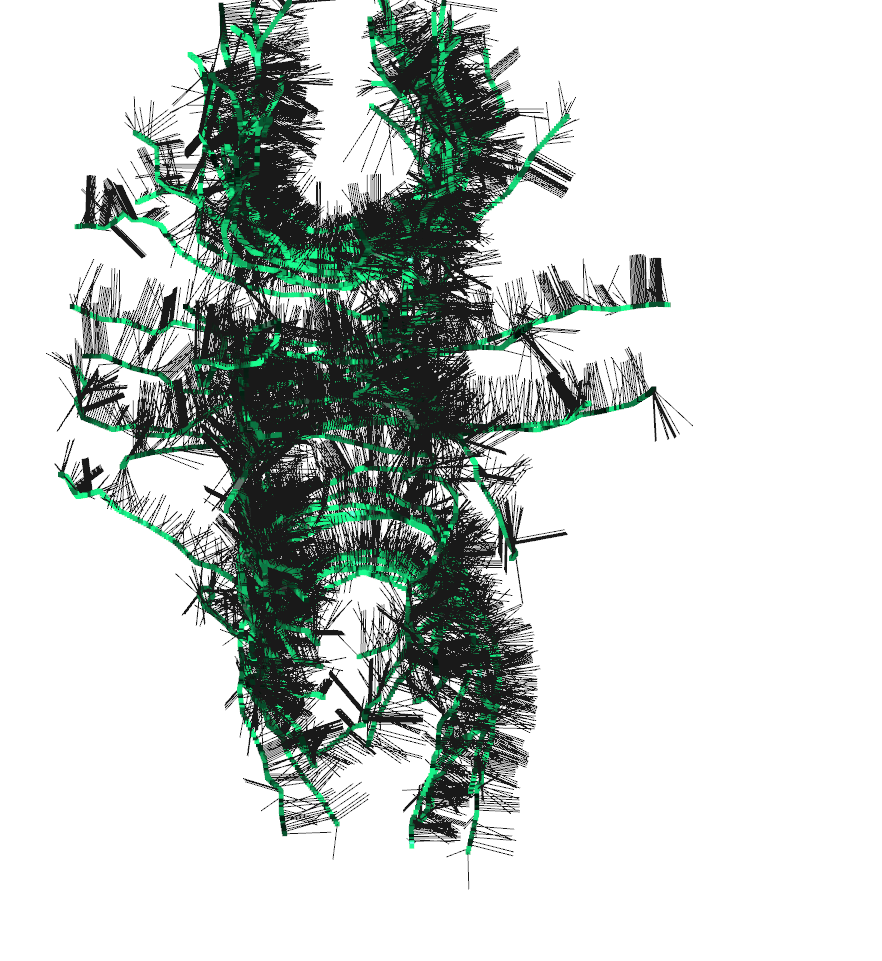
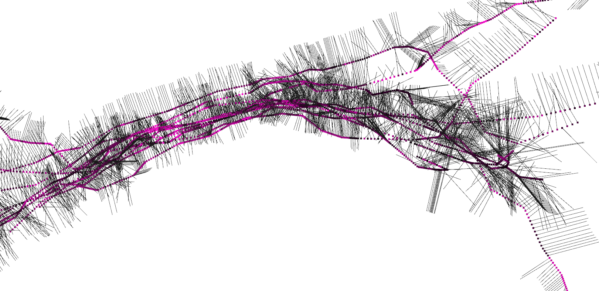
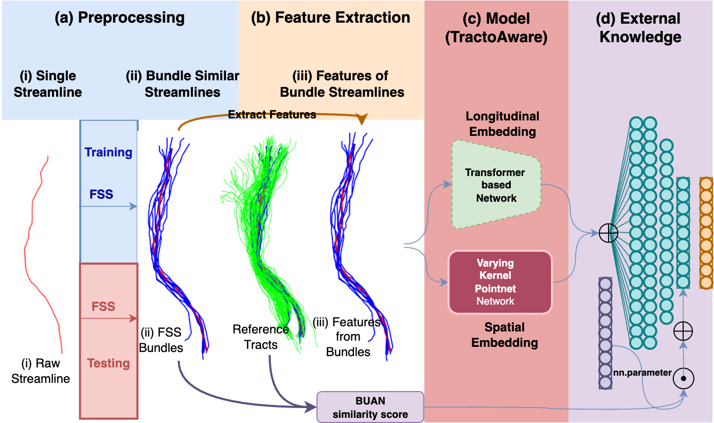
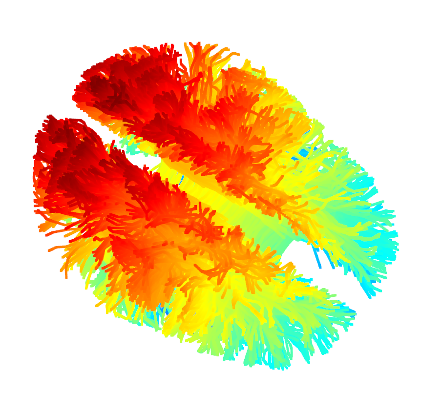

# TractoAware

In TractoAware, I explored augmenting (x,y,z) coordinates with multiple features which would make a single point an n-dimensional array. From (x,y,z) -> (x, y, z, xp, yp, zp, xn, yn, zn, x_theta, y_theta, z_theta), since pointcloud is said to learn all the features along with (x,y,z) point coordinates. 

| Full-view of normals | Normals Zoomed-in|
|-|-|
||  |

Loss function was also modified to incorporate a physics-based loss along with classification cross-entropy loss. Physics-aware loss boosted the performance for bundles which seemed closer in shape to the parent cluster. 

To learn particular streamline and cluster shape, I extracted spatial and longitudinal embedding using a Transformer-based network and Varying Kernel size Pointnet Network respetively.

In **TractoAware**, we essentially embed multiple features into the point cloud, extracting spatial and longitudinal embeddings to be trained on physics-based and classification cross entropy loss.

Ground Truth reference tracts per bundle are saved, as reference to compute BUAN (BUndle ANalytics) score with the selected group of tracts.

