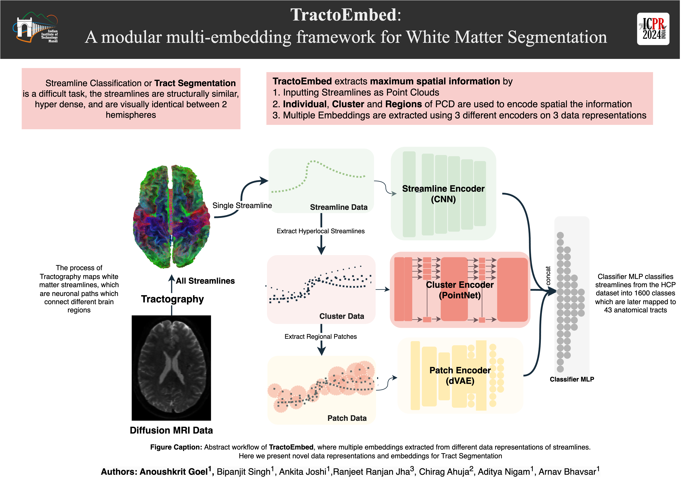

# TractoEmbed
> Accepted conference paper at **ICPR** 2024 (27th International Conference on Pattern Recognition)



White matter tract segmentation is crucial for studying brain
structural connectivity and neurosurgical planning. However, segmentation remains challenging due to issues like class imbalance between major and minor tracts, structural similarity, subject variability, symmetric streamlines between hemispheres etc. To address these challenges, we propose TractoEmbed, a modular multi-level embedding framework,
that encodes localized representations through learning tasks in respective encoders. 

In this paper, **TractoEmbed** introduces a novel hierarchical streamline data representation that captures maximum spatial information at each level i.e. individual streamlines,clusters ,and patches. Experiments show that TractoEmbed outperforms state-of-the-art methods in white matter tract segmentation across different datasets, and spanning various age groups. The modular framework directly allows the integration of additional embeddings in future works.


## Results

| **Data**                              | **Model: Type**           | **Acc (%)** | **F1 (%)** |
|---------------------------------------|---------------------------|-------------|------------|
| **Single Streamline**                 | DeepWMA (CNN)             | 90.29       | 88.12      |
|                                       | DCNN++ (CNN)              | 91.26       | 89.14      |
|                                       | PointNet (PCD)            | 91.36       | 89.12      |
|                                       | DGCNN (Graph)             | **91.85**   | **89.78**  |
| **Local PCD** (k = 20)                | TractCloud: PointNet      | 91.51       | 89.25      |
|                                       | TractCloud: DGCNN (Graph) | 91.91       | 90.03      |
|                                       | **TractoEmbed (ours)**    | **92.09**   | **90.07**  |
| **Hyperlocal PCD** (k = 5)            | TractCloud (PointNet)     | 91.12       | 88.66      |
|                                       | **TractoEmbed (ours)**    | **93.04**   | **91.38**  |
| **Local + Global Representation**     | TractCloud: PointNet      | **92.28**   | **90.36**  |
|                                       | TractCloud: DGCNN (Graph) | 91.99       | 90.10      |


**Refer for more:**

TractoEmbed: Modular Multi-level Embedding framework for white matter tract segmentation 

[Springer Paper Link](https://link.springer.com/chapter/10.1007/978-3-031-78104-9_17) | [Github](https://www.github.com/tractoembed) | [arxiv](https://arxiv.org/pdf/2411.08187) |
[Poster](20628-poster.pdf) | 
[Explainer Video](20628-video.mp4)


### Reference

Please cite our work!!
```bibtex
@inproceedings{goel2024tractoembed,
  title={TractoEmbed: Modular Multi-level Embedding framework for white matter tract segmentation},
  author={Goel, Anoushkrit and Singh, Bipanjit and Joshi, Ankita and Jha, Ranjeet Ranjan and Ahuja, Chirag and Nigam, Aditya and Bhavsar, Arnav},
  booktitle={International Conference on Pattern Recognition},
  pages={240--255},
  year={2024},
  organization={Springer}
}
```