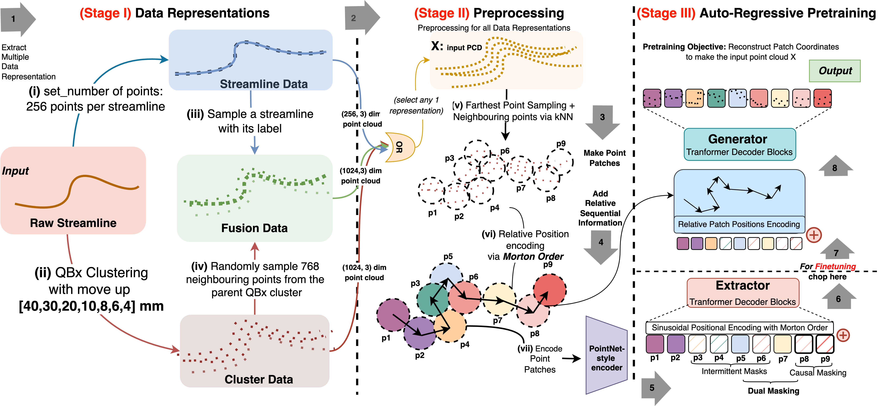

# TractoGPT

> Accepted as conference paper at [ISBI](https://biomedicalimaging/2025) 2025 (International Symposium on Biomedical Imaging 2025)

**Abstract**

White matter bundle segmentation is crucial for studying brain structural connectivity, neurosurgical planning, and neurological disorders. White Matter Segmentation remains challenging due to structural similarity in streamlines, subject variability, symmetry in 2 hemispheres, etc. To address these challenges, we propose TractoGPT, a GPT-based architecture trained on streamline, cluster, and fusion data representations separately. TractoGPT is a fully-automatic method that generalizes across datasets and retains shape information of the white matter bundles. Experiments also show that TractoGPT outperforms state-of-the-art methods on average DICE, Overlap and Overreach scores. We use **TractoInferno** and **105HCP** datasets and validate generalization across dataset





Refer for more:
[Github](https://www.github.com/anoushkrit/TractoGPT) | [arxiv](https://arxiv.org/pdf/2501.15464) 


Please cite our work!! 

```bibtex
@article{goel2025tractogpt,
  title={TractoGPT: A GPT architecture for White Matter Segmentation},
  author={Goel, Anoushkrit and Singh, Simroop and Joshi, Ankita and Jha, Ranjeet Ranjan and Ahuja, Chirag and Nigam, Aditya and Bhavsar, Arnav},
  journal={arXiv preprint arXiv:2501.15464},
  year={2025}
}
```