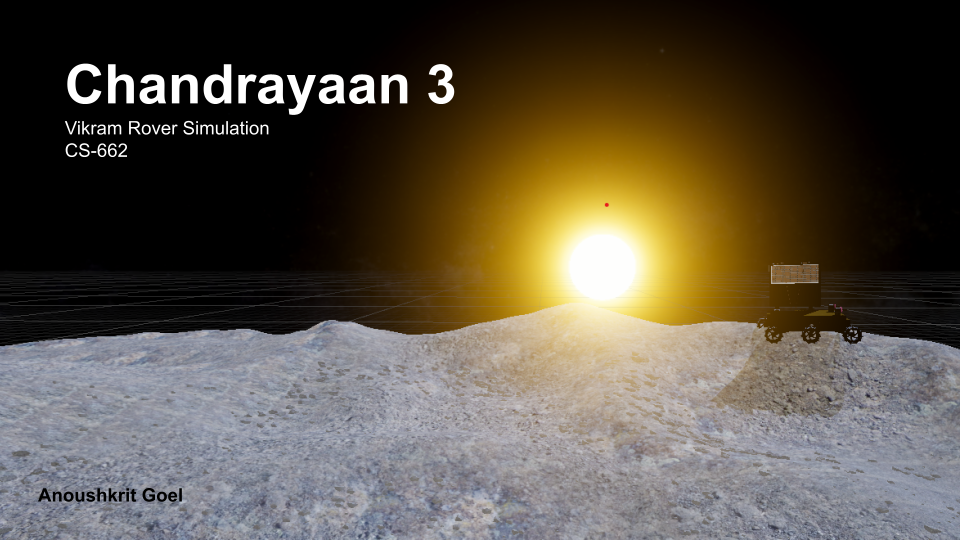
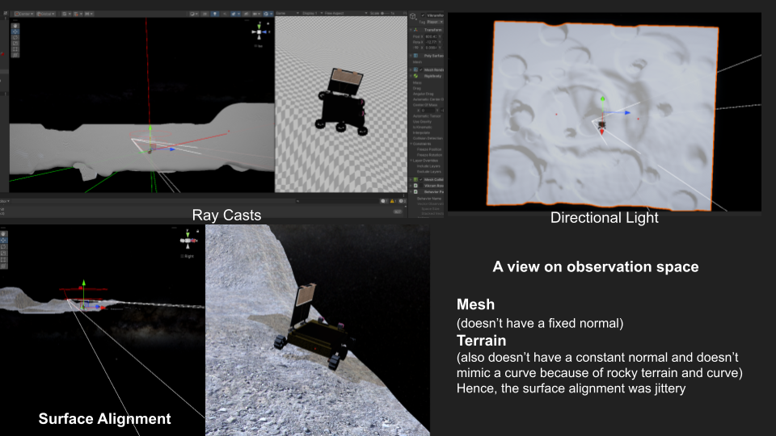

# VikramUnity

   

The **VikramUnity** project simulates the navigation of India's Vikram Rover on the moon's dark side, built using Unity and a tech stack including Python, C#, PyTorch, and NumPy. Inspired by India's historic Chandrayaan landing, this simulation replicates the rover's navigation on uneven lunar terrain to reach mining locations (red cubes) while minimizing bumps, falls, and time wastage under time constraints. It addresses the research gap in optimizing autonomous rover navigation on complex terrains by integrating AI and VR for realistic simulations. The novelty lies in combining rough terrain modeling, time-sensitive navigation, and damage minimization strategies into an immersive simulation. Possible impacts include enhancing training for planetary navigation systems, improving autonomous rover designs, and supporting space exploration missions. Contributions include creating a 3D lunar terrain model, implementing AI-driven navigation logic, designing observation spaces for rover feedback, and completing the simulation as part of the CS662 course on Mobile VR and AI.
Vikram rover landed on the dark side of the moon and this marked India's historic accomplishment to land an un-manned vehicle on the dark side of the moon. 
 

To capture this momentous occassion I built this Vikram Rover on the uneven lunar surface on Unity. 
I built a 3D object to reach to a location (red dot) after each run/episode till the rover is in free fall.

Objective of our Vikram Rover Simulation is to 
 1. **navigate on a rough and hilly moon terrain** and 
 2. **reach mining locations (red cube)**, within the time window when the directional light gets dimmed. Also with the time constraints, the rover needs to 
 3. **minimise bumps and falls in the rocky terrain** to avoid damage and 
 4. **minimise time wasted** in navigating to the path.

> This project was in partial completion of the course CS662: Mobile VR and AI by Dr. Varun Dutt

Tech Stack: Python, Unity, C#, pytorch , numpy

[Github](https://github.com/anoushkrit/VikramUnity) | [PPT](https://docs.google.com/presentation/d/1wQoDasHbFlfAqP3PYtXYbdBWSJHIq6he9klwArfDPAs/edit?usp=sharing)
