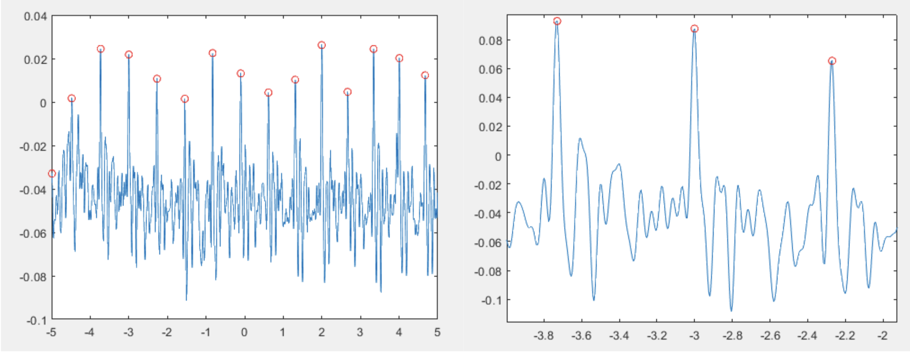
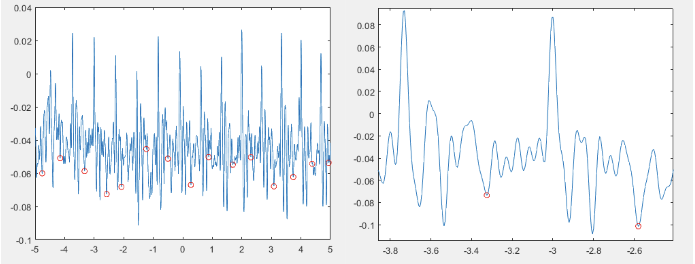

# pyCardiograms

pyCardiograms is a set of algorithms built to annotate peaks, measure peak values for different cardiograms. For full depth analyses on multiple modalities of cardiograms. 
Builds upon Neurokit

**Aortic Valve Opening**

**Mitral Valve Opening**

> This project was sub-part of my startup Tensr.ai, where we created the hardware to capture multimodal cardiac signals, and analysed them for giving insights. 

> Primarily, this project was an extension of the hardware implementation I did in my Bachelors under the guidance of Dr. Ranendra Narayan Biswas as my Major Project required for the fulfillment of my Bachelors Thesis in Electronics and Communication Engineering.